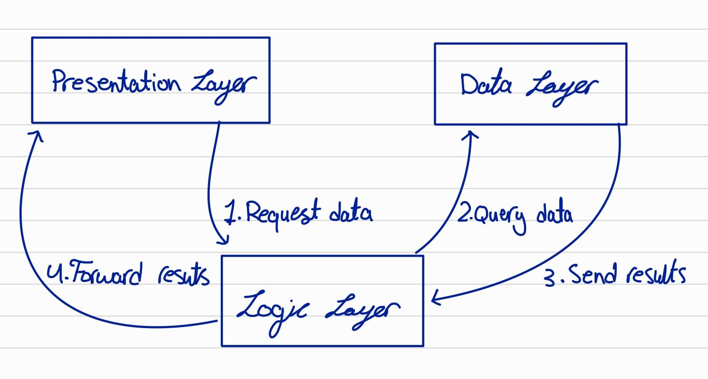

# Odoo Multi-Tier Architecture

Odoo follows a **three-tier architecture**, where each tier is **separated** for modularity and scalability:

## 1. Presentation Tier (Client/UI)

- Handles user interactions via web, mobile, or desktop clients.
- Uses **JavaScript, XML**, and **OWL (Odoo Web Library)** for UI.

## 2. Application Tier (Business Logic)

- Processes requests, applies business rules, and interacts with the database.
- Written in **Python** with Odoo’s **ORM** for data management.

## 3. Data Tier (Database/Storage)

- Stores and manages structured data.
- Uses **PostgreSQL** as the backend database.

# Odoo Modules and Modularity

## What is an Odoo Module?

An **Odoo module** is a self-contained package that adds specific functionality to Odoo. It includes **models, views, controllers, and business logic**, enabling customization and extension of Odoo's core features.

## Why is Modularity Important in Odoo?

- **Scalability** – Businesses can add or remove features as needed.
- **Customization** – Modules allow tailored solutions without modifying the core system.
- **Maintainability** – Independent modules simplify debugging and updates.
- **Reusability** – Developers can reuse modules across multiple projects.

## How Do Modules Interact with Each Other?

- **Inheritance** – A module can extend or modify an existing module’s functionality using model inheritance.
- **Dependencies** – Modules can depend on other modules, ensuring required features are loaded.
- **API Calls** – Modules communicate via XML-RPC or REST API for integration.
- **Database Relations** – Modules link via relational fields (e.g., `Many2one`, `One2many`).

This modular design ensures **flexibility, efficiency, and seamless integration** within the Odoo ecosystem.

# Basic Directory Structure of an Odoo Module

An Odoo module follows a structured directory layout to maintain organization and modularity.

## **Directory Structure**

module
├── models
│ ├── _.py
│ └── **init**.py (organizes python files)
├── data
│ └── _.xml
├── **init**.py
└── **manifest**.py (declares modules)

# Differences Between Odoo Community and Odoo Enterprise

## **1. Key Differences**

Odoo offers two editions: **Community** (free and open-source) and **Enterprise** (paid with additional features).

## **2. Suitable Edition for Custom Development**

If a company requires **custom development**, **Odoo Community** is more suitable because:

- It provides full access to the **source code**, allowing deep modifications.
- No licensing fees, making it cost-effective for in-house development.
- Greater flexibility for custom business logic and integrations.

Both are customizable, however, if the company needs **advanced features** and **official support**, Odoo Enterprise may be a better option despite higher costs.

# Identify Architecture Components

# References

1. [https://www.odoo.com/documentation/17.0/developer/tutorials/server_framework_101/01_architecture.html](https://www.odoo.com/documentation/17.0/developer/tutorials/server_framework_101/01_architecture.html)
2. [https://www.reddit.com/r/Odoo/comments/17crtnh/can_community_edition_match_the_features_of/?rdt=63420](https://www.reddit.com/r/Odoo/comments/17crtnh/can_community_edition_match_the_features_of/?rdt=63420)
3. ChatGPT
